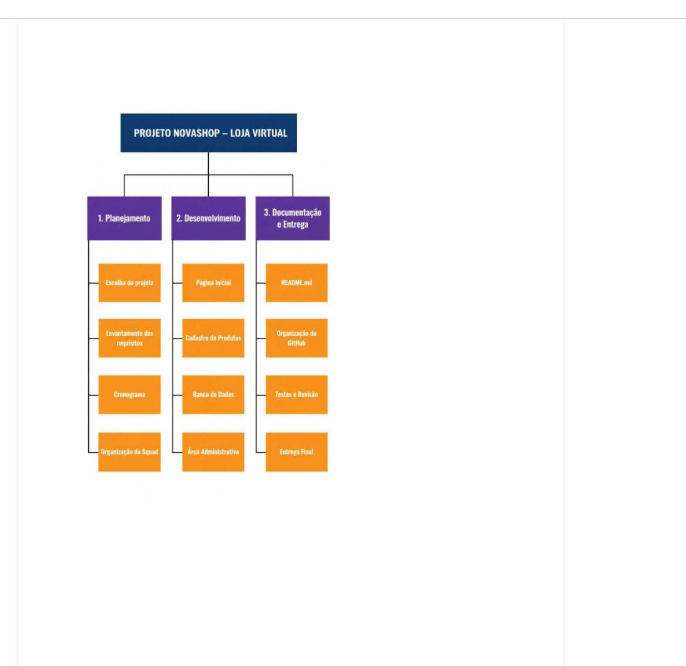

# 🎾 Site Tênis

## 📋 Descrição do Projeto

O projeto Site Tênis tem como objetivo desenvolver uma interface web relacionada ao universo do tênis, organizando inicialmente a documentação, o planejamento, os wireframes e a estrutura do projeto para a próxima etapa de desenvolvimento.

O projeto está sendo desenvolvido durante o curso Técnico em Desenvolvimento de Sistemas, utilizando ferramentas como Visual Studio Code, Git e GitHub.

---

## 🎯 Objetivo

O objetivo do projeto é planejar e estruturar o desenvolvimento de um site sobre tênis antes do início da codificação em HTML.

Nesta etapa foram realizados o planejamento da interface, a criação dos wireframes, a organização da estrutura de pastas, o Code Review e a documentação inicial do projeto.

---

## 📌 Etapa Atual

O Projeto 01 está na etapa de fechamento do dossiê e preparação para a SA 01 de HTML.

Nesta etapa estão sendo organizados:

- Documentação do projeto;
- EAP e Cronograma;
- Wireframes;
- Estrutura de pastas;
- Code Review;
- Repositório Git;
- README.md.

---

## 📊 EAP e Cronograma

A EAP e o cronograma apresentam as etapas planejadas para o desenvolvimento do projeto.

### EAP

A Estrutura Analítica do Projeto organiza as principais atividades necessárias para o desenvolvimento do sistema, desde o planejamento inicial até as etapas de desenvolvimento.

### Cronograma

O cronograma apresenta a organização das atividades e das próximas etapas do projeto.

A imagem da EAP/Cronograma está disponível na pasta `docs`.



---

## 🖼️ Wireframes

Os wireframes foram desenvolvidos durante a etapa de UX e representam a estrutura visual das páginas do projeto antes da implementação em HTML e CSS.

Os arquivos dos wireframes estão organizados na pasta:

`docs/wireframes`

---

## 🔎 Code Review

Foi realizado um Code Review do projeto para analisar a organização e a estrutura dos arquivos desenvolvidos.

O documento do Code Review está disponível no arquivo:

`Code_Review_Site_Tenis.pdf`

---

## 📁 Estrutura do Projeto

```text
site_tenis/
│
├── .git/
│
├── assets/
│   ├── icons/
│   └── images/
│
├── css/
│
├── docs/
│   ├── EAP_Cronograma.png
│   └── wireframes/
│
├── js/
│
├── Code_Review_Site_Tenis.pdf
│
└── README.md


# Relatório — Introdução à Web e Linguagens de Marcação

## Parte 1 — Engenharia Reversa de Sintaxe

### 1. Semântica personalizada de dados

O Trecho C (XML), porque ele permite criar tags personalizadas para representar os dados sem se preocupar com a aparência deles na tela.

### 2. Documentação de código

O Markdown, porq+e é simples, rápido de escrever e muito utilizado para criar arquivos de documentação, como o README.md de projetos no GitHub.

### 3. Página principal de uma loja virtual

O HTML5, porque ele é responsável por criar a estrutura da página. O CSS pode ser usado para a aparência e o JavaScript para as funcionalidades.

## Parte 2 — Auditoria de Infraestrutura

### 1. Registro de domínio

Valor do domínio .com.br por 1 ano: **R$ XX,XX**.

Também é possível registrar o domínio por períodos maiores.

### 2. Rastreamento de IP

Comando utilizado:

`ping senai.br`
IPv4 retornado:
**191.233.16.218**


### 3. Whois 
Domínio analisado: `uol.com.br`

- **Entidade/Empresa:** A PR
  - A PREENCHER
EENCHER
- **Data de criação:** A PREENCHER
- **Data de expiração:** A PREENCHER
- **Servidores DNS:**
  - A PREENCHER+